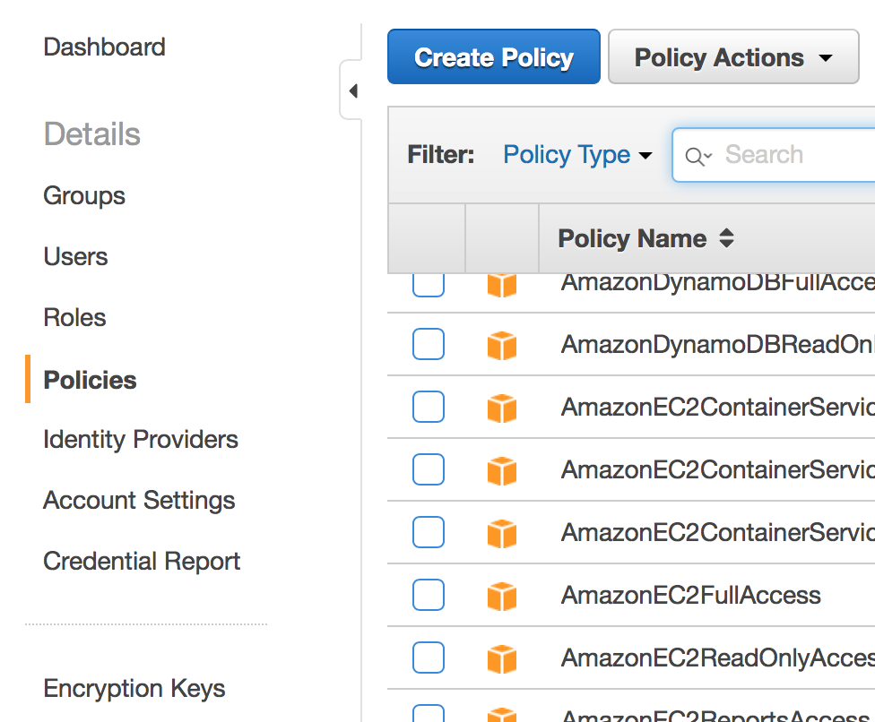
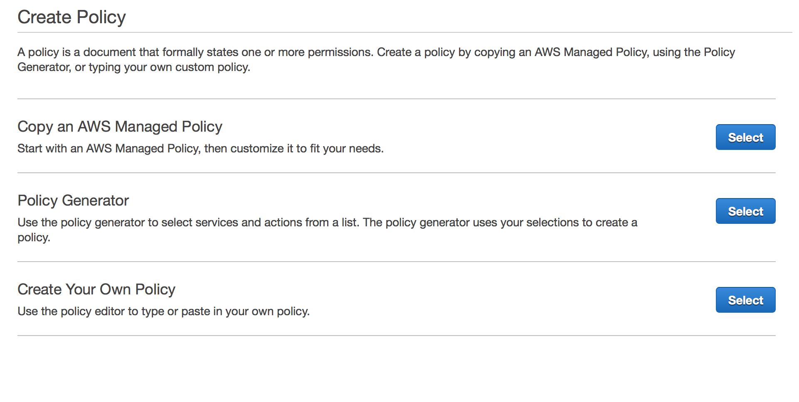
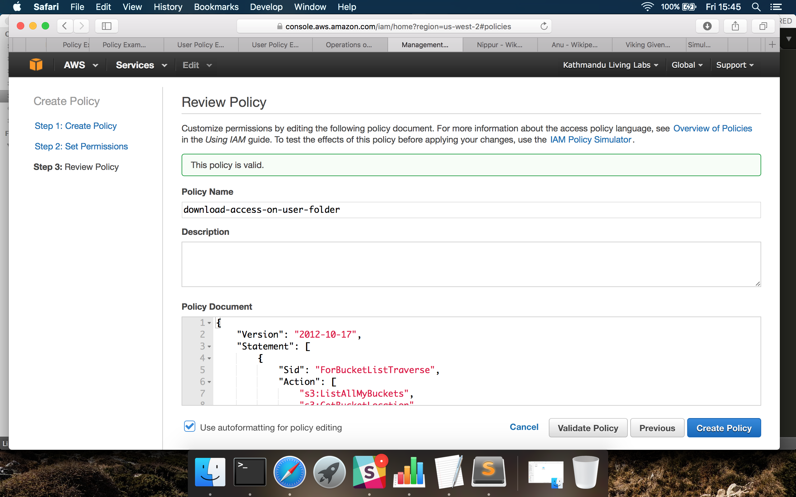
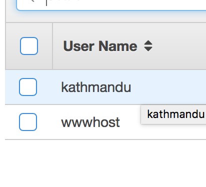
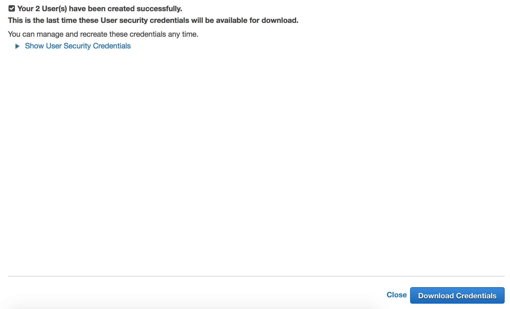
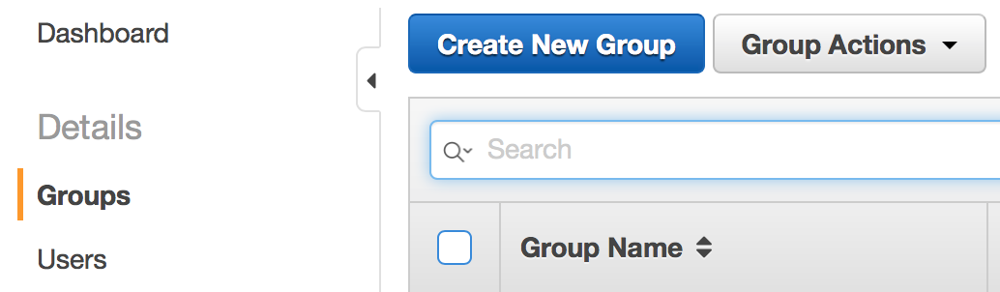
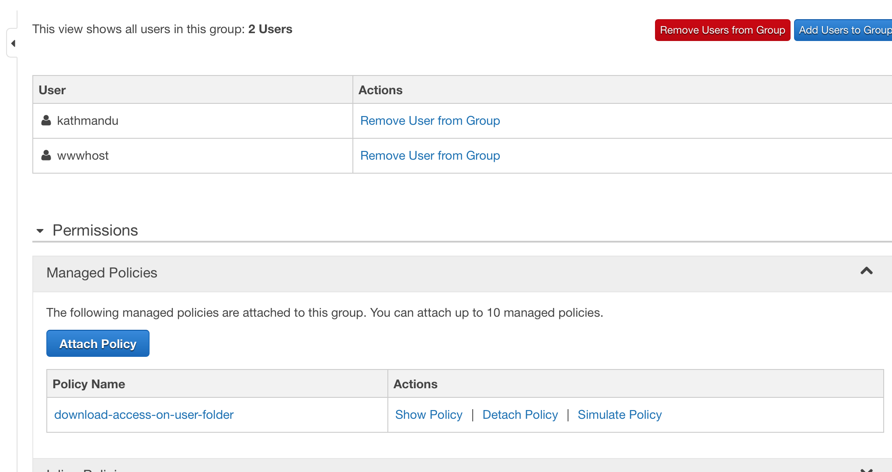

Giving download access to user folders in AWS S3
================================================

###1. Log on to your AWS Management Console at console.aws.com and go to the S3 Dashboard

###2. Click on `Services` on the top-left of the dashboard and goto `Security And Identity > IAM`

###3. Using the navigation pane on the left, goto `Policies`. Then Click `Create Policy`

###4. Select `Create you own policy`.

###5.Give the policy a name such as `download-access-to-user-folder`, and paste the following code into the `Policy Document` field:
    
{
  "Version":"2012-10-17",
  "Statement": [
    {
      "Sid": "ForBucketListTraverse",
      "Action": ["s3:ListAllMyBuckets", "s3:GetBucketLocation"],
      "Effect": "Allow",
      "Resource": ["arn:aws:s3:::*"]
    },
    {
      "Sid": "ForRootDirectoryTraverse",
      "Action": ["s3:ListBucket"],
      "Effect": "Allow",
      "Resource": ["arn:aws:s3:::bucket-name"],
      "Condition":{"StringEquals":{"s3:prefix":[""],"s3:delimiter":["/"]}}
    },
    {
      "Sid": "ForListingContentsOfUserFolders",
      "Action": ["s3:ListBucket"],
      "Effect": "Allow",
      "Resource": ["arn:aws:s3:::bucket-name"],
      "Condition":{"StringLike":{"s3:prefix":["${aws:username}/*"]}}
    },
    {
       "Sid": "EnableDownloadAccessOnUserFolder",
       "Action":[
                "s3:GetObject",
                "s3:GetObjectAcl",
                "s3:GetObjectTorrent",
                "s3:GetObjectVersion",
                "s3:GetObjectVersionAcl",
                "s3:GetObjectVersionTorrent"
                ],
       "Effect":"Allow",
       "Resource": ["arn:aws:s3:::bucket-name/${aws:username}/*"]
    }
  ]
}

###6. Now create a User:
####1. Using the navigation pane on the left, goto `Users`, click `Create a new user` and fill in the username(s). Click `Create`.

####2. Click `Download the Access Keys` and store the csv file downloaded in a safe place.

###7. Now create a Group:
####1. Using the navigation pane on the left, goto `Group` and click `Create a New Group`. Give a name to the group: eg. `users`.

####2. Now attach the policy you just created to the group.

###8. Smile :)
Now the user has download access to the contents of the folder that matches the path `/user-name/`. The same policy will be applied to any user added to this group.

